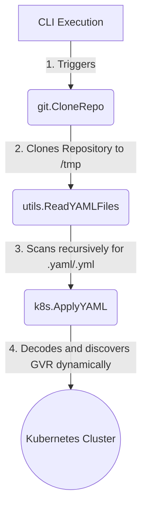

# FlamingGo GitOps Engine

FlaminGo GitOps Engine is a lightweight, pure-Go implementation of a GitOps agent for Kubernetes. It is designed to pull raw Kubernetes YAML manifests from a specified branch in a remote Git repository and automatically apply them to a cluster using the Kubernetes Dynamic Client.

## Architecture

At a high level, FlaminGo GitOps Engine performs the following workflow:



1. **Clone**: The `git` module uses `go-git` to perform a fast, shallow clone (`depth=1`) of the target branch.
2. **Scan**: The `utils` module recursively traverses the cloned directory to locate any `.yaml` or `.yml` files.
3. **Apply**: The `k8s` module parses the raw YAML, maps it to a REST endpoint (`GroupVersionResource`), and applies it using the `client-go` dynamic API against the host cluster.

## Setup & Execution

### Prerequisites
* Go 1.21+
* Run inside a Kubernetes cluster (relies on `InClusterConfig()`) or map your config appropriately.

### Usage
Run the engine by pointing it to your infrastructure repository:

```bash
go run main.go https://github.com/your-org/your-infra-repo.git
```

### Examples
When you run the engine, it will output logs detailing the cloning process and what resources were successfully created or updated:

```text
Cloned repo to: /tmp/repo-123456
Applied: Deployment my-app
Applied: Service my-app-svc
```